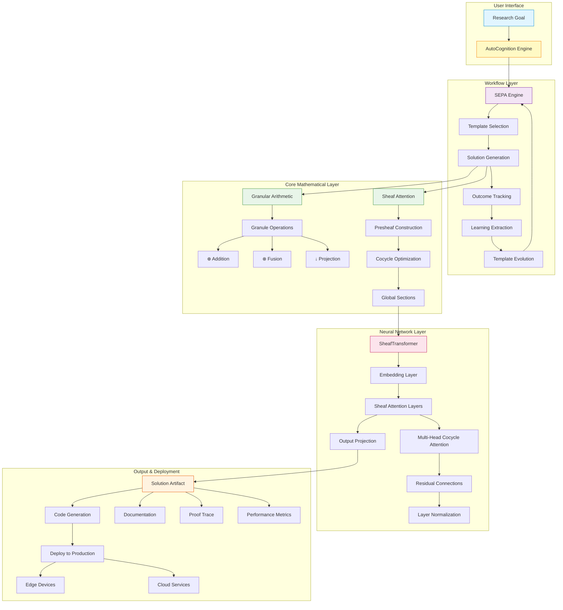
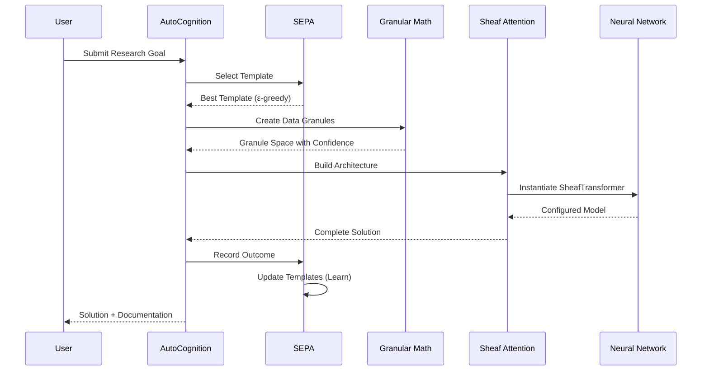
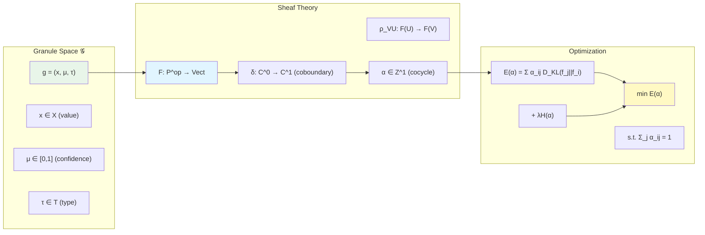
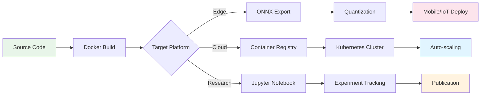

# GraNT Framework Architecture Diagram



## Component Descriptions

### User Interface Layer
- **Research Goal**: Natural language task specification with constraints and metrics

### Workflow Layer
- **AutoCognition Engine**: Main orchestrator
- **SEPA Engine**: Self-Evolving Prompt Architecture for adaptive templates
- **Template Selection**: Multi-armed bandit optimization
- **Solution Generation**: Autonomous architecture design
- **Outcome Tracking**: Persistent performance logging
- **Learning Extraction**: Pattern recognition from history
- **Template Evolution**: Continuous improvement loop

### Core Mathematical Layer
- **Granular Arithmetic**: 
  - ⊕ (Addition): Type-aware combination with confidence min
  - ⊗ (Fusion): Context-preserving aggregation with confidence product
  - ↓ (Projection): Lipschitz-bounded transformation with uncertainty propagation

- **Sheaf Attention**:
  - Presheaf Construction: Hierarchical feature organization
  - Cocycle Optimization: Minimize informational tension
  - Global Sections: Consistent cross-level aggregation

### Neural Network Layer
- **SheafTransformer**: Complete transformer architecture
- **Multi-Head Cocycle Attention**: Parallel attention heads with cohomological constraints
- **Residual Connections**: Skip connections for gradient flow
- **Layer Normalization**: Stable training dynamics

### Output & Deployment
- **Solution Artifact**: Complete package ready for deployment
  - Generated code (PyTorch modules)
  - Documentation (usage guides)
  - Proof traces (mathematical derivations)
  - Performance metrics (latency, memory, accuracy)

- **Deployment Targets**:
  - Edge devices (mobile, IoT)
  - Cloud services (AWS, GCP, Azure)

## Data Flow



## Mathematical Framework



## Deployment Pipeline



---

## Key Innovations Visualized

### 1. Uncertainty Propagation

```
Input Granule: g₁ = ([1,2,3], 0.9, VECTOR)
      ↓ (Lipschitz transformation L=1.5)
Project: normalize(·)
      ↓
Output: g₂ = ([0.27,0.53,0.80], 0.87, VECTOR)
                                  ↑
                    Confidence decreased due to L
```

### 2. Cocycle Attention

```
Features: f₁, f₂, ..., fₙ
      ↓
Compute: D_KL(fⱼ || fᵢ) for all pairs
      ↓
Optimize: α* = argmin Σ α_ij D_KL + λH(α)
      ↓
Result: α_ij = softmax(-D_KL(fⱼ||fᵢ)/λ)
```

### 3. Template Evolution

```
Iteration t: Template_v1 → Execute → Metrics → Score
      ↓
Learning: Extract patterns from outcomes
      ↓
Evolution: Template_v2 = Template_v1 + Δ(patterns)
      ↓
Selection: ε-greedy choose between versions
      ↓
Iteration t+1: Best template → Execute → ...
```

---

This architecture enables:
✅ End-to-end autonomous research
✅ Mathematical rigor with practical efficiency
✅ Continuous self-improvement
✅ Production-ready deployment
